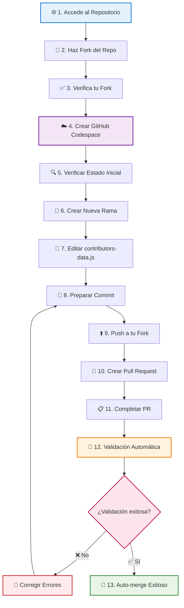

# 🚀 XperienceCampusWorkshop - ¡Únete a la Comunidad!

Una página web colaborativa donde desarrolladores de todo el mundo pueden contribuir con su información personal y aprender sobre colaboración en proyectos open source.

## 🤝 Agradecimientos

Este taller fue posible gracias a la colaboración de:

- 🎓 **[Developer Student Clubs UTP](https://www.linkedin.com/company/dsc-utp/)** - Comunidad de estudiantes desarrolladores
- 🌟 **[Xperience Campus Chimbote](https://www.linkedin.com/company/xperience-campus/)** - Impulsando el crecimiento tecnológico en Chimbote

Gracias a estas organizaciones pudimos llevar a cabo este workshop de Git & GitHub, proporcionando a los participantes una experiencia práctica y colaborativa en el desarrollo de software open source.

## 🌐 Ver la Página Web

👉 **[Visita la página web aquí](https://dav082004.github.io/XperienceCampusWorkshop/)**

## 🎯 ¿Cómo Contribuir y Qué Practicarás?

### 🛠️ Habilidades que Desarrollarás

Al participar en este proyecto, practicarás y aprenderás:

#### **Git & GitHub Workflow**

- 🍴 **Forking**: Crear una copia del repositorio en tu cuenta
- 🌿 **Branching**: Crear y manejar ramas para organizar tu trabajo
- 📝 **Commits**: Guardar cambios con mensajes descriptivos
- ⬆️ **Push/Pull**: Sincronizar cambios entre local y remoto
- 🔄 **Pull Requests**: Proponer cambios para revisión
- 🤝 **Merge**: Integrar cambios al proyecto principal

### 🚀 Tipos de Contribución

#### **🆕 Contribución Básica (Recomendada para Principiantes)**

```javascript
// Agregar tu información personal al proyecto
{
  name: "Tu Nombre Completo",
  nickname: "tu-github-username",
  github: "https://github.com/tu-username",
  linkedin: "https://linkedin.com/in/tu-perfil", // Opcional
  instagram: "https://www.instagram.com/tu-instagram/", // Opcional
  image: "https://github.com/tu-username.png", // Opcional - Avatar de GitHub
  description: "Breve descripción profesional (máx. 150 caracteres)",
  hobbies: ["Hobby1", "Hobby2", "Hobby3", "Hobby4"] // Máximo 4
}
```

### ☁️ GitHub Codespace - Entorno Preconfigurado

Este proyecto está optimizado para usar **GitHub Codespace**, que te proporciona:

#### **✨ Ventajas del Codespace**
- 🚀 **Configuración instantánea** - Sin instalaciones locales
- 🔧 **Extensiones preinstaladas** - Live Server, Image Preview, Git
- 🌐 **Acceso desde cualquier lugar** - Solo necesitas un navegador
- 💾 **Guardado automático** - Tus cambios se sincronizan automáticamente
- 🎯 **Enfoque en el código** - Sin preocuparte por dependencias

#### **🛠️ Extensiones Incluidas**
- **Live Server** - Vista previa en tiempo real de la página
- **Image Preview** - Visualización de imágenes en el editor
- **Git Graph** - Historial visual de commits
- **Auto Close Tag** - Cierre automático de etiquetas HTML
- **IntelliSense** - Autocompletado inteligente
### 🎓 Lo Que Aprenderás Paso a Paso

| Concepto | Descripción | Habilidad Práctica |
|----------|-------------|--------------------|
| 🔧 **Configuración de Entorno** | GitHub Codespace preconfigurado | Trabajar sin instalaciones locales |
| 🍴 **Workflow de Fork** | Crear tu propia copia del proyecto | Colaborar sin afectar el original |
| 🌿 **Gestión de Ramas** | Organizar trabajo en features | `git checkout -b feat/nueva-funcionalidad` |
| 📝 **Commits Semánticos** | Mensajes claros y estructurados | `feat:`, `fix:`, `docs:` |
| 🔄 **Pull Request Process** | Proponer cambios para revisión | Comunicación efectiva en equipo |
| 👥 **Code Review** | Recibir y dar feedback | Mejorar la calidad del código |
| 🤖 **Continuous Integration** | Validaciones automáticas | Detectar errores antes del merge |
| 🚀 **Merge y Deploy** | Ver tu trabajo en producción | Ciclo completo de desarrollo |

## 📊 Flujo de Contribución



### 🎯 Guía Rápida de Comandos

| Paso | Acción | Comando/Instrucción | 💡 Tip |
|------|--------|-------------------|--------|
|1-2|🍴 **Fork & Verificar**|`Botón Fork → Create fork`|Asegúrate que diga "forked from Dav082004"|
|3|☁️ **Crear Codespace**|`Code → Codespaces → Create`|Espera 1-2 min para la configuración completa|
|4|🔍 **Verificar Estado**|`git status`<br/>`git branch --all`|Debes estar en `main` con working tree clean|
|5|🌿 **Nueva Rama**|`git checkout -b feat/new-tunickname`|Reemplaza `tunickname` con tu usuario GitHub|
|6|📝 **Editar Archivo**|Abrir `contributors-data.js`|Agregar al final, antes del `];`|
|7|💾 **Staging**|`git add contributors-data.js`|Solo añadir el archivo modificado|
|8|📝 **Commit**|`git commit -m "feat: add new profile for tunickname"`|Mensaje claro y descriptivo|
|9|⬆️ **Push**|`git push origin feat/new-tunickname`|Sube tu rama al fork en GitHub|
|10|🔄 **Crear PR**|`Compare & pull request`|GitHub lo detecta automáticamente|
|11|📋 **Completar PR**|Título + Descripción + Create|Explica qué agregaste|
|12|🤖 **Validación**|Automática|Si falla, revisa los comentarios del bot|
|13|🎉 **Merge**|Automático si pasa validación|¡Tu perfil aparece en la web!|

### 📝 Plantilla de Datos

```javascript
// Copia y pega esta plantilla al final de contributors-data.js
{
  name: "Tu Nombre Completo",
  nickname: "tu-github-username",
  github: "https://github.com/tu-username",
  linkedin: "https://linkedin.com/in/tu-perfil", // Opcional
  instagram: "https://instagram.com/tu-usuario", // Opcional
  image: "https://github.com/tu-username.png", // Tu avatar de GitHub
  description: "Tu descripción profesional (máx. 150 caracteres)",
  hobbies: ["Hobby1", "Hobby2", "Hobby3", "Hobby4"] // Máximo 4
},
```

## 🤖 Sistema de Validación Inteligente

### ✅ Validaciones Automáticas

Nuestro bot validador revisa automáticamente:

| Validación | Descripción | ❌ Error Común |
|------------|-------------|----------------|
|📝 **Sintaxis JSON** | Estructura correcta del objeto | Falta coma al final `},` |
|🏷️ **Campos Requeridos** | `name`, `nickname`, `github`, `description`, `hobbies` | Campos vacíos o undefined |
|🔗 **URLs válidas** | GitHub, LinkedIn, Instagram funcionales | URLs incompletas o incorrectas |
|🎯 **Límite de Hobbies** | Máximo 4 elementos en el array | Array con más de 4 elementos |
|📏 **Longitud Descripción** | Máximo 150 caracteres | Texto demasiado largo |
|🚫 **No Duplicados** | Nickname único en el sistema | Username ya existe |
|🔤 **Formato Nickname** | Solo letras, números, guiones | Caracteres especiales no permitidos |

### 🔧 Troubleshooting - Solución de Problemas

#### 🚨 **Si tu PR es rechazado**
1. **Lee los comentarios del bot** - Te dice exactamente qué corregir
2. **Haz cambios en la misma rama** - No crees una nueva
3. **Commit y push nuevamente** - Los cambios se agregan automáticamente al PR

#### 💡 **Mejores Prácticas**

```bash
# ✅ Verificar antes de commit
git status                    # Ver qué archivos cambiaron
git diff contributors-data.js # Ver exactamente qué modificaste

# ✅ Commit con mensaje descriptivo
git commit -m "feat: add profile for [tu-nickname]"

# ✅ Verificar que el push fue exitoso
git push origin feat/new-tu-nickname
# Debes ver: "remote: Create a pull request for 'feat/new-tu-nickname'"
```

#### 🆘 **Errores Frecuentes y Soluciones**

| Error | Causa | Solución |
|-------|-------|----------|
|`SyntaxError: Unexpected token` | Falta coma o corchete | Revisar sintaxis JSON |
|`Duplicate nickname` | Username ya existe | Cambiar por uno único |
|`Invalid GitHub URL` | URL incorrecta o usuario no existe | Verificar tu username en GitHub |
|`Description too long` | Más de 150 caracteres | Acortar la descripción |
|`Too many hobbies` | Más de 4 elementos | Reducir a máximo 4 hobbies |

## 📋 Reglas y Guidelines

### ✅ Permitido

- Modificar únicamente `contributors-data.js`
- Agregar exactamente **1 colaborador por PR**
- Usar tu propio GitHub username como nickname
- Incluir información real y profesional
- Usar GitHub Codespace para editar (recomendado)

### ❌ No Permitido

- Modificar otros archivos (HTML, CSS, JS principal)
- Agregar múltiples colaboradores en un solo PR
- Usar información falsa o inapropiada
- Duplicar nicknames existentes

### 💬 Recursos de Ayuda

#### 📚 **Guías Detalladas**
- 🌟 [**Guía Completa con Codespace**](pages/como-contribuir-codespace.html) - *Recomendado para principiantes*
- 💻 [Guía para Contribución Local](pages/como-contribuir-local.html) - *Para usuarios avanzados*
- 🎯 [Página de Teoría Git/GitHub](pages/teoria.html) - *Conceptos fundamentales*

#### 🆘 **Soporte Técnico**
- 🐛 [Reportar un Bug](https://github.com/Dav082004/XperienceCampusWorkshop/issues/new?labels=bug) - *Algo no funciona*
- 💡 [Sugerir Mejora](https://github.com/Dav082004/XperienceCampusWorkshop/issues/new?labels=enhancement) - *Ideas para el proyecto*
- ❓ [Hacer Pregunta](https://github.com/Dav082004/XperienceCampusWorkshop/issues/new?labels=question) - *Dudas sobre contribución*
- 📖 [Ver Issues Existentes](https://github.com/Dav082004/XperienceCampusWorkshop/issues) - *Tal vez ya hay respuesta*

#### 🎓 **Recursos Adicionales**
- 📋 [Plantilla de Contribución](https://github.com/Dav082004/XperienceCampusWorkshop/blob/main/.github/PULL_REQUEST_TEMPLATE.md)
- 🔍 [Ver Ejemplos de PRs Exitosos](https://github.com/Dav082004/XperienceCampusWorkshop/pulls?q=is%3Apr+is%3Amerged)
- 📊 [Estado del Proyecto](https://github.com/Dav082004/XperienceCampusWorkshop/pulse) - *Actividad reciente*

### 🌟 Contribuciones Avanzadas

¿Quieres contribuir con código? También aceptamos:

- 🐛 Corrección de bugs
- ✨ Nuevas características
- 📖 Mejoras en documentación
- 🎨 Mejoras de diseño

Para estas contribuciones, abre un issue primero para discutir los cambios.
